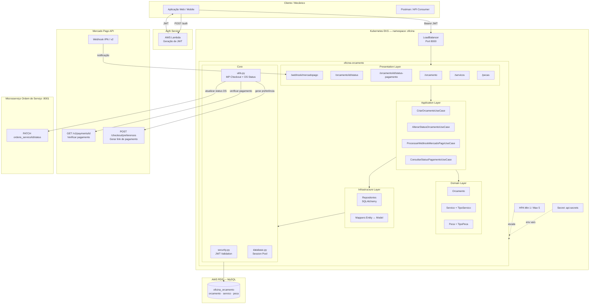
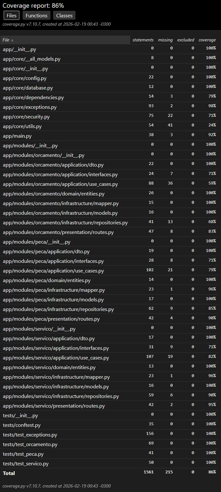

# Oficina Mecânica — Orçamento

Microsserviço responsável pelo fluxo de orçamento, composição de valor (serviços e peças), integração com Mercado Pago e confirmação de pagamento.

---

## Arquitetura



> Diagrama completo: [architecture.mmd](architecture.mmd)

---

## 1) Fluxo de orçamento e pagamento (Mercado Pago)

O fluxo completo segue as etapas:

```
OS aprovada → Criar orçamento → Adicionar serviços/peças
           → Gerar checkout Mercado Pago → Link de pagamento enviado ao cliente
           → Pagamento realizado → Webhook recebido → Status atualizado → OS avança
```

1. **Criação do orçamento** — vinculado a uma OS específica.
2. **Composição do valor** — serviços (`/servicos`) e peças (`/pecas`) adicionados ao orçamento.
3. **Geração de checkout** — ao submeter o orçamento, é gerada uma preferência de pagamento na API do Mercado Pago (`gerar_checkout_preference_mercado_pago`).
4. **Aprovação** — o cliente realiza o pagamento pelo link gerado.
5. **Finalização** — webhook recebido confirma o pagamento e atualiza o status do orçamento e da OS.

### Rotas principais (Swagger/OpenAPI)

Swagger UI disponível em `/docs`. Porta padrão: **8000**.

#### Orçamento
| Método | Rota | Descrição |
|--------|------|-----------|
| `POST` | `/orcamento` | Criar orçamento |
| `GET` | `/orcamento/{orcamento_id}` | Buscar orçamento |
| `PATCH` | `/orcamento/{orcamento_id}/status` | Alterar status do orçamento |
| `GET` | `/orcamento/{orcamento_id}/status-pagamento` | Consultar pagamento no Mercado Pago |
| `POST` | `/webhook/mercadopago` | Receber notificação de pagamento |
| `DELETE` | `/orcamento/{orcamento_id}` | Remover orçamento |

#### Serviços
| Método | Rota | Descrição |
|--------|------|-----------|
| `POST` | `/servicos` | Cadastrar serviço |
| `GET` | `/servicos/{servico_id}` | Buscar serviço |
| `PUT` | `/servicos/{servico_id}` | Atualizar serviço |
| `PATCH` | `/servicos/{servico_id}/vincular/{orcamento_id}` | Vincular serviço ao orçamento |
| `PATCH` | `/servicos/{servico_id}/desvincular` | Desvincular serviço |
| `DELETE` | `/servicos/{servico_id}` | Remover serviço |
| `GET` | `/servicos/tipo-servico` | Listar tipos de serviço |
| `POST` | `/servicos/tipo-servico` | Criar tipo de serviço |
| `GET` | `/servicos/tipo-servico/{tipo_servico_id}` | Buscar tipo de serviço |

#### Peças
| Método | Rota | Descrição |
|--------|------|-----------|
| `POST` | `/pecas` | Cadastrar peça |
| `GET` | `/pecas/{peca_id}` | Buscar peça |
| `PUT` | `/pecas/{peca_id}` | Atualizar peça |
| `PATCH` | `/pecas/{peca_id}/vincular/{orcamento_id}` | Vincular peça ao orçamento |
| `PATCH` | `/pecas/{peca_id}/desvincular` | Desvincular peça |
| `GET` | `/pecas/tipo-peca` | Listar tipos de peça |
| `POST` | `/pecas/tipo-peca` | Criar tipo de peça |
| `GET` | `/pecas/tipo-peca/{tipo_peca_id}` | Buscar tipo de peça |

#### Health Check
| Método | Rota |
|--------|------|
| `GET` | `/health` |

---

## 2) Webhook/Confirmação de pagamento

O endpoint `/webhook/mercadopago` aceita dois formatos de notificação:

**IPN legado (query string):**
```
POST /webhook/mercadopago?topic=payment&id={payment_id}
```

**Webhook moderno (JSON body):**
```json
{
  "type": "payment",
  "data": { "id": "12345678" }
}
```

Fluxo ao receber o webhook:
1. Extrai o `payment_id`.
2. Consulta status do pagamento na API do Mercado Pago (`verificar_pagamento_mercado_pago`).
3. Atualiza `status_orcamento` e salva `mp_payment_id` no banco.
4. Chama o serviço de OS para avançar o status da Ordem de Serviço.

Para consultar manualmente o status de um pagamento já processado:
```
GET /orcamento/{orcamento_id}/status-pagamento
```

---

## 3) Publicação de eventos / chamada ao serviço de OS

Após confirmação do pagamento, este microsserviço notifica o serviço de **Ordem de Serviço** via HTTP:

| Evento | Chamada ao Serviço de OS |
|---|---|
| Pagamento aprovado | `PATCH /veiculos/1/ordens_servico/{os_id}/status` |

A URL base é configurada via `URL_API_OS`. A lógica de integração fica em `app/core/utils.py`.

---

## 4) Execução local e deploy no Kubernetes

### Execução local

**Com Docker Compose:**
```bash
docker-compose up -d
```
A API sobe na porta `8000` e o MySQL na `3307`.

**Sem Docker (venv):**
```bash
pip install -r requirements.txt

export USER_DB=root
export PASSWORD_DB=root
export HOST_DB=127.0.0.1
export PORT_DB=3306
export DATABASE=oficina_orcamento
export SECRET_KEY=fakerandomsecretkey
export ALGORITHM=HS256
export JWT_ISSUER=oficina-auth
export JWT_AUDIENCE=oficina-api
export URL_API_OS=http://localhost:8001

uvicorn app.main:app --reload --port 8000
```

### Deploy no Kubernetes (AWS EKS)

```bash
# Criar namespace
kubectl apply -f k8s/namespace.yaml

# Criar secret com credenciais
kubectl apply -f k8s/secret.yaml -n oficina

# Deployment, Service e HPA
kubectl apply -f k8s/deployment.yaml -n oficina
kubectl apply -f k8s/service.yaml -n oficina
kubectl apply -f k8s/hpa.yaml -n oficina
```

O serviço é exposto via **LoadBalancer** (AWS ELB) na porta `8000`. Para obter o DNS público:
```bash
kubectl get svc oficina-orcamento-api-service -n oficina
```

---

## 5) Testes + cobertura

Executar suíte completa com cobertura mínima de **80%**:

```bash
pytest --cov=app --cov-report=xml --cov-report=html --cov-fail-under=80 --maxfail=1 --disable-warnings -q
```

Relatórios gerados em:
- `coverage.xml` — integração com CI/CD
- `htmlcov/index.html` — relatório visual

